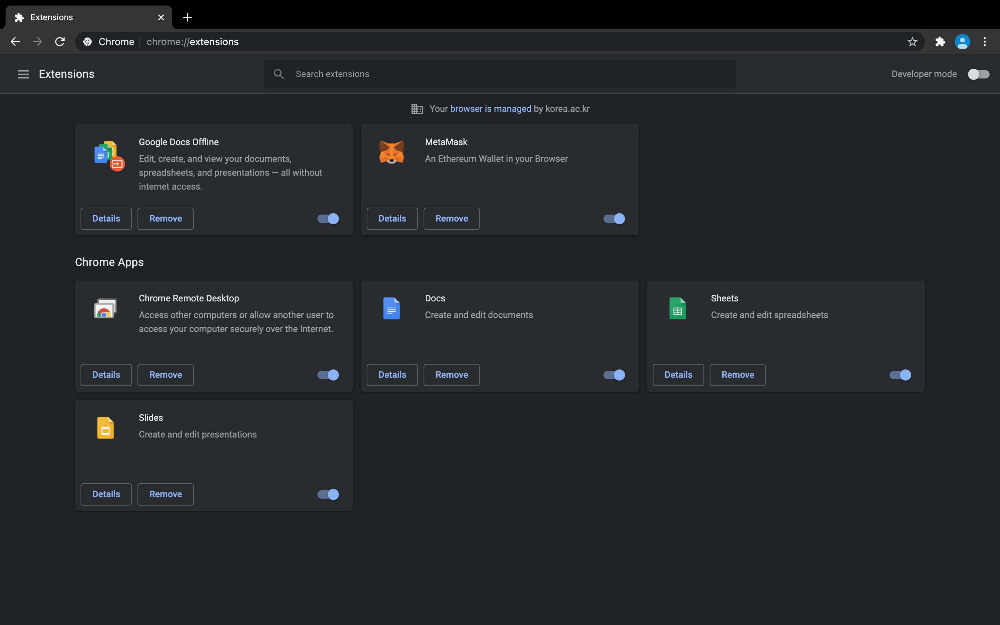
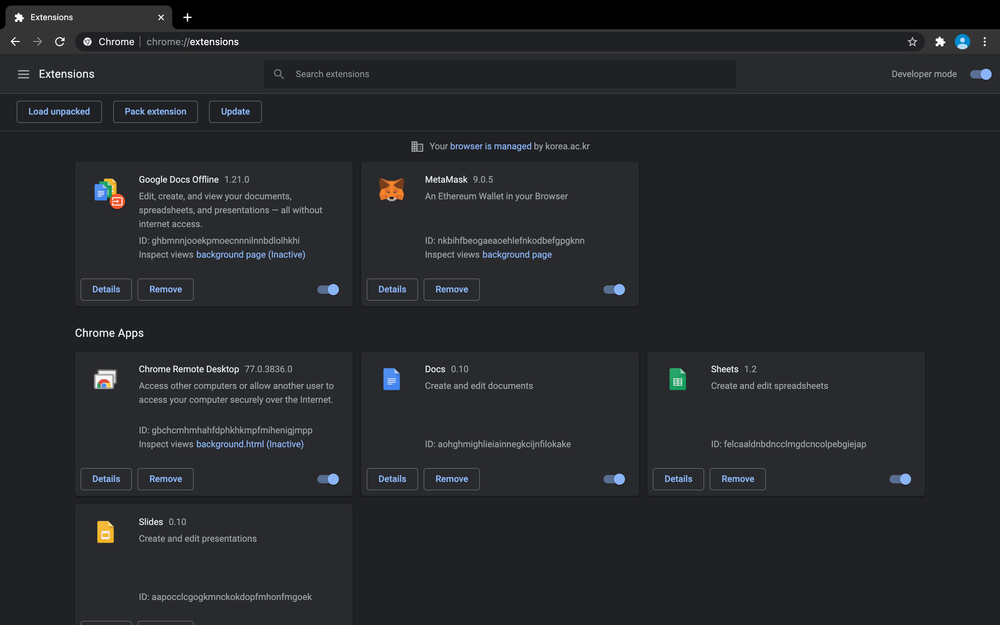
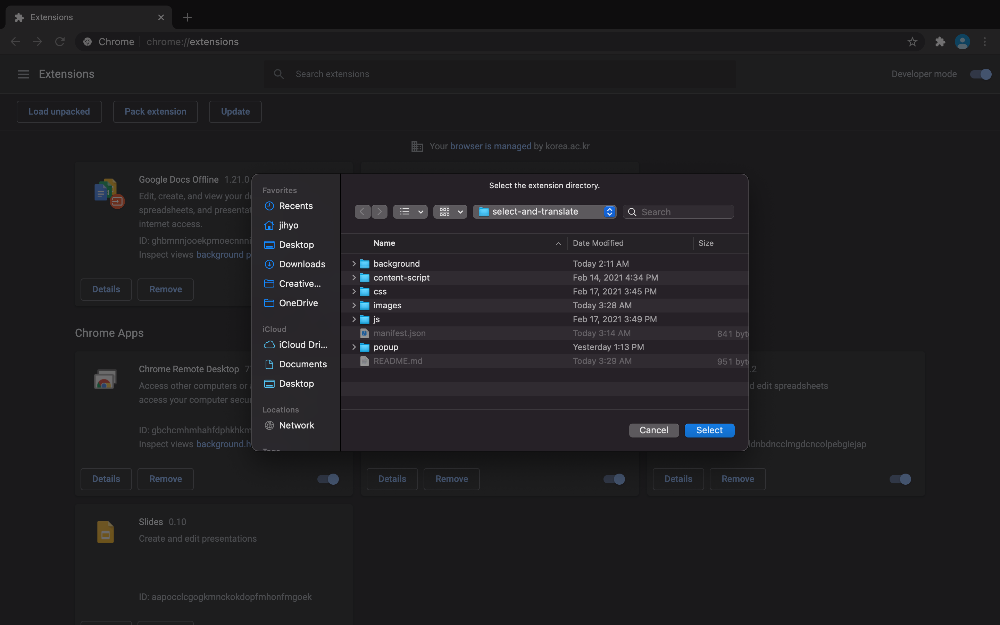
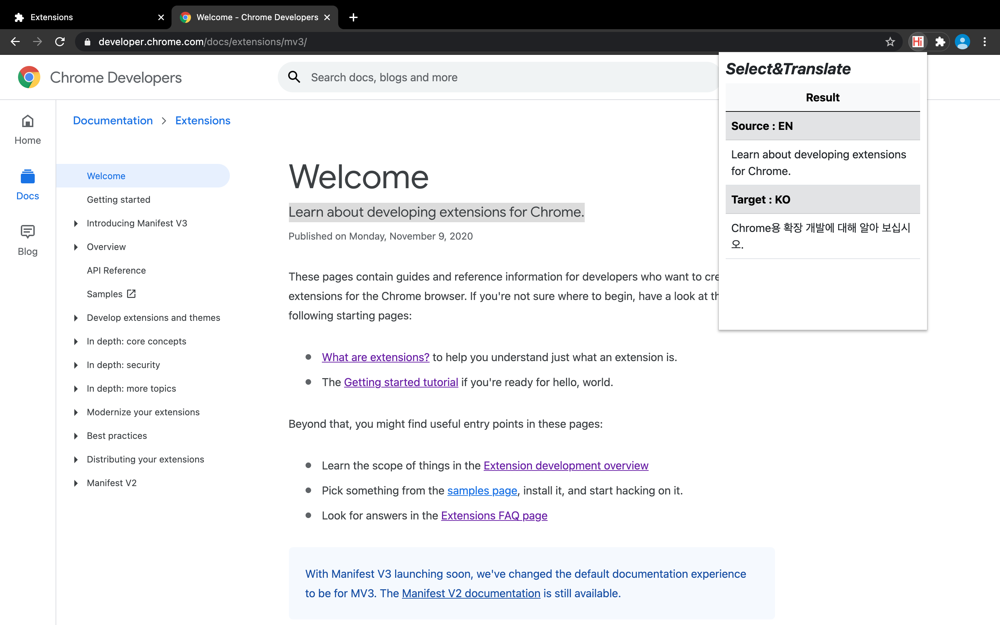

# Chrome Extensions : Select&Translate
A chrome extension that translates the selected text
## Description
_Select&Translate_ is a chrome extension that translates the text when you select it.

_Select&Translate_ 는 문장을 선택하면 즉시 번역해주는 크롬 확장 프로그램입니다.
## Installation
1. Clone the project. / 프로젝트 폴더를 내려받으세요.
    ```shell
    git clone https://github.com/hi-jihyo/dapp-food-tracer.git
    ```
2. Open Chrome and go to `chrome://extensions`. / 크롬 브라우저를 열고 `chrome://extensions`로 이동하세요.
    
3. Click `developer mode`. / `개발자 모드`를 클릭하세요.
    
4. Click `Load unpacked` and open the project directory. / `Load unpacked`을 클릭하고 프로젝트 폴더를 여세요.
    
5. Go to any site, select any text and press `Ctrl+T` (or click the _Select&Translate_ icon). It will show the translated text.
 
    아무 사이트에 들어가서, 텍스트를 선택하고 `Ctrl+T`를 눌러보세요 (혹은 _Select&Translate_ 아이콘을 클릭하세요). 번역된 텍스트를 확인할 수 있습니다.
    

> Note:
> ___
> Currently, English → Korean only / 현재로써는 영어 → 한국어만 가능
